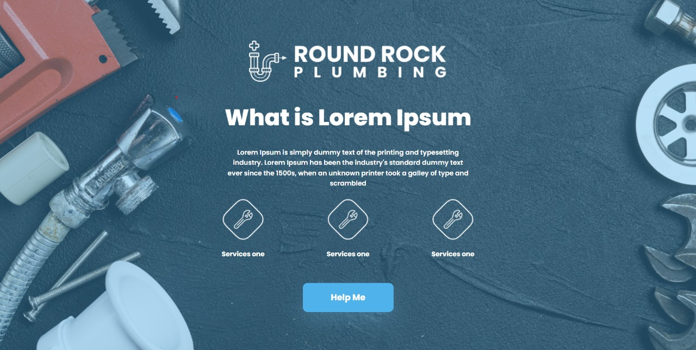
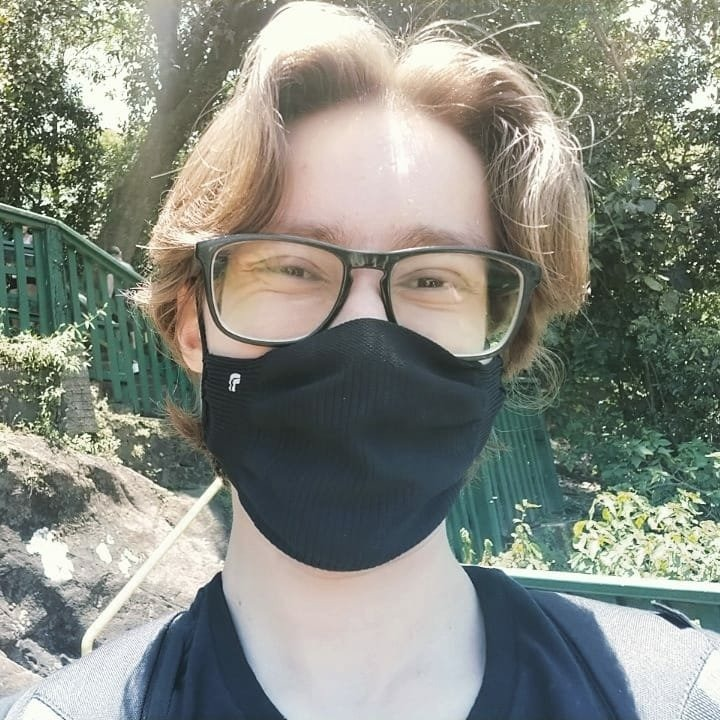

# Nome do projeto




> Teste para aplicação de HTML e CSS.
### Ajustes e melhorias

O projeto ainda está em desenvolvimento e as próximas atualizações serão voltadas nas seguintes tarefas:

- [x] Terminar o HTML
- [x] Terminar o CSS
- [ ] Tornar responsivo


## ☕ Usando <nome_do_projeto>

Para usar <round-rock-plumbing>, siga estas etapas:

```
<Entrar no link "https://limael.github.io/round-rock-plumbing/">
```

## 🤝 Colaboradores

Agradecemos às seguintes pessoas que contribuíram para este projeto:

<table>
  <tr>
    <td align="center">
      <a href="#">
        <br>
        <sub>
          <b>Gustavo Rafael de Lima</b>
        </sub>
      </a>
    </td>
  </tr>
</table>


[⬆ Voltar ao topo](#nome-do-projeto)<br>